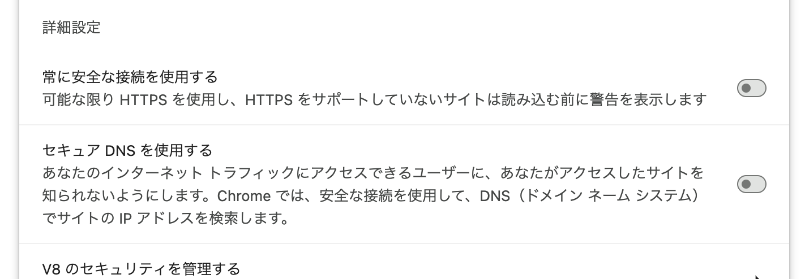

MacでWi-Fiを使おうと接続したがインターネットに繋がらない。
HTTPプロキシの設定が必須なようなので、設定しても繋がらない。
`ERR_PROXY_CONNECTION_FAILED` エラーが出る。

iPhoneでは問題なくつながる。
MacのGoogle Chromeではダメだったが、Safariではつながるようだった。

ファイアウォールの設定やプロキシ設定の見直しなど見直したがどれもダメ。
Safariではつながるので、Chrome側の設定に問題があると判断。

よ〜く設定を見てみると、「[セキュアDNSを使用する](https://developers-jp.googleblog.com/2020/06/secure-dns.html)」という項目が有効になっていた。
無効化したところ、問題なく接続できるようになった。

「セキュアDNSを使用する」は、ChromeがWebサイトにアクセスする時、Google Public DNS などの暗号化されたDNSを使うようにするための設定。Wi-FiやプロキシとDNSの相性が悪かったのかもしれない。
